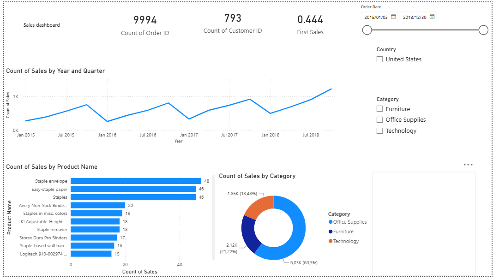

## Superstore Sales Dashboard
Overview:

This project is an interactive sales dashboard built in Microsoft Power BI using the Superstore dataset. It provides insights into sales and product perfomance, customer activity, and category trends through interactive visualizations.

## Features

KPI cards displaying Order and Customer Count, and Average Sales
Sales trend analysis by Year and Quarter
Product perfomance analysis
Sales distribution by Category
Interactive slicers for Date, Country and Category

## Tools used:
Microdoft Power BI
Power Query
DAX 
CSV Dataset

Dashboard Insights:

Track sales perfomance over time
Identify the most frequently sold products
Compare sales across different product category
Filter constant changing results using interactive slicers.

## Skills demostrated
Data visualization
Data Analysis
Dashboard Deisgn
KPI Reporting
Power BI
Power Query
DAX

Repository contents:

Superstore Sales Dashboard (.pbix)
CSV dataset

Note: The current file extensin (.pbix) is Pokémon Analytics Dashboard and soon to be renamed to Superstore Sales Dashboard.

## Screenshot

